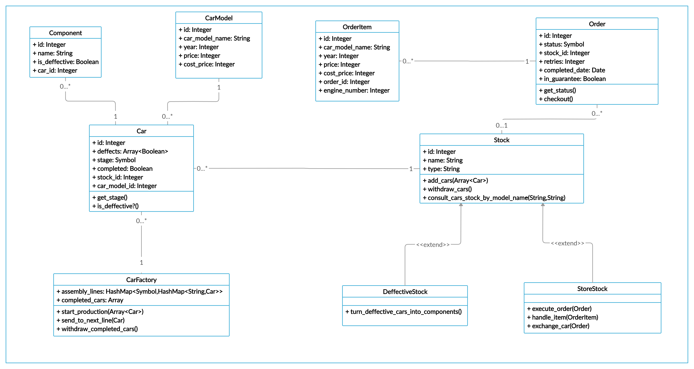

# Robot World

## First things first, how do you run this project?

This project is contained in docker, so if you don't have it: [Install it](https://docs.docker.com/get-docker/), then specifiy your postgress username and password in the `docker-compose.yml` file like this:

    db:
        image: postgres
        environment:
        - POSTGRES_USERNAME=postgres
        - POSTGRES_PASSWORD=1234

You'll have an `application.yml` file in your `config` folder, here you will be able to apply certain variables to the execution and set the database info needed. Setting your postgres user/pass in both files is needed for the way docker handles the postgres image in the container.

All of the variables are harmless except for the `START_FROM_SCRATCH` one, you must be careful, if starting from scratch, to have you DB populated, otherwise the processes won't behave as expected.

The variables are all expressed in integers to simplify operations and the time related ones such as `TIME_BETWEEN_BUYING_CARS` (actually the only one) is considered as minutes.

Also, all of the values specified (except for the ones for the database and the one for the slack webhook) have a default value inside the project, so if none's specified, there will be no conflict.

Take into consideration that the value `CAR_COMPONENTS` and `CAR_MODELS` are taking a parsed JSON string to work, so it must be surrounded by simple quotes and using double quotes for key strings.

Now, in this order, run:

    docker-compose build
    docker-compose run web yarn install
    docker-compose up

Here you'll need to wait until you see a message like this one:

    web_1  | * Environment: development
    web_1  | * Listening on tcp://0.0.0.0:3000
    web_1  | Use Ctrl-C to stop

and then you can continue running these commands on a separate terminal:

    docker-compose run web rake db:create
    docker-compose run web rake db:migrate
    docker-compose run web rake db:migrate RAILS_ENV=test
    docker-compose run web rake db:seed
    

for creating the database, tables and populating the database.

The first time you run this project is the first time you will need to run all of these commands, then you will be good to go with just `docker-compose up` and `docker-compose down` to stop it (from a separate terminal).

## Now into the fun part!

I used [Crono](https://github.com/plashchynski/crono) for handling the tasks schedules, and to run them all you can use:

    docker-compose run web bundle exec crono

If you want to run them in separate terminals for better discernment of the information, here are the commands representing the different processes of the project:

`docker-compose run web rake db:seed` This will, if wanted, erase all records an populate the DB with the ones needed to begin or just create new car models, depending on the variable `START_FROM_SCRATCH` from the `application.yml` config file.

`docker-compose run web rake robot_builder:start_production` Will start the robot builder car creation process

`docker-compose run web rake guard_robot:move_cars_from_factory_to_store_stock` Will make the guard robot move the cars from the factory stock into the store stock or the deffective stock.

`docker-compose run web rake robot_buyer:buy_cars` Will start the robot buyer process of buying the cars and returning some of them.

`docker-compose run web rake robot_buyer:exchange_cars`Will make the robot buyer start wanting to exchange some completed orders.

`docker-compose run web rake robot_builder:cleanup` Will allow the robot builder to do a car cleanup each certain amount of time.

`docker-compose run web rake exec_robot:generate_business_statistics` Will generate the data for the execs robots to be happy.

If in any moment you want to access the rails console to make some tests, just type

    docker-compose run web rails c

All the tasks iteration time can be edited inside the `config/cronotab.rb` file.

## The Data Structure

In order to clarify the flow of this project but to no longer extend the Readme, I've created [this document](https://docs.google.com/document/d/1IogkwtHjTzrFMr3FADonEnHVM7AQcQTy3clHC9FeM70/edit?usp=sharing).
 
The whole car building process stands on these models :

+ CarModel: States the Model name, year, price and cost of this particular model.
+ Component: Esential part needed to build the car and determine if it's deffective or not.
+ Car: The representation of the conjunction of the Components and the CarModel.
+ CarFactory: This is not an actual record of the DB. This is a model used for the representation of the stages that a Car goes through when being built.
+ Stock: Represents all of the stocks where the Cars can be stored.
+ DeffectiveStock: Contains specific logic to destroy the car and retrieve the good components to be reutilized.
+ StoreStock: Contains specific methodsthat sustains the business logic.
+ Order: Represents the transaction between the buyer and the business model.
+ OrderItem: As its name represents, it's states for each item of each order. As it is now in the project, one order can have only one item, but I've prepared the logic to be able to handle more than one item in each order in all the processes.

## The problem

I've compared this situation to the moment where I go to a clothing store and they say to me 'Oh, we don't have that T-shit that you like so much in stock right now, but if you want, you can come back in two days and we'll have it !'.
Based on this premise, everytime the robot buyer goes to buy a car to the stock, based on a probability, it will retry to buy the cars pending that he 'liked so much'. This operation can take a maximum amount of retries, after said amount if the robot buyer didn't get the car, it will give up and the order will be considered as a 'Lost Car Sale'. If the probability turns out to be truth, he will retry to buy all of the orders that are pending and didn't maxed out the retry amount.

## The Other Problem

This process is triggered by the `docker-compose run web rake robot_buyer:exchange_cars` command and it will take an amount of fixed orders that will come in as a wave each time it's executed and try exchange the cars in them. The process ensures that the new car model wanted is different from the one/s that exists in the order.
The returned car will be added to the store stock to be sold and then the order will be treated as a new one without actually creating another order so the revenue statistics stay precise.
If the store stock has the car model available to be sold, it will be exchanged for the new one, but if there's no stock, the robot buyer will refuse to get another one and the order will be considered as a 'Lost Exchange'.

## A plus

The command `docker-compose run web rake exec_robot:generate_business_statistics` will reveal:
+ Daily revenue from the previous day.
+ The cost of the operations that day.
+ The cars sold in units.
+ The average order price the previous day, regardless of that order being completed, pending or declared as lost sale or lost exchange.
+ The pending amount of revenue from orders created the day before
+ The pending amount of car units from orders created the day before.
+ The amount of orders that are still in guarantee (able to be exchanged if the robot buyer desires to).
+ The lost sales due to model unavailability (in units).
+ The lost sales due to model unavailability (in money).

## Some added features

+ In the moment where the guard robot segregates the deffective cars from the non deffective ones, the deffective cars are not discarded. Actually, they are taken to a deffective stock where they will be decomposed into individual components again so the non deffective components can be reutilized in new cars. Then, when the robot builder composes new cars, it evaluates for each component if there are a non deffective component available that isn't associated with any car to use, and only creates a new one if there's none.

+ The orders have a boolean indicating if it's still in guarantee to be exchanged. If they're not, they're not eligible to be exchanged. And they stop being in guarantee when the cleanup is executed (once a day).

## Tests

All that the robots do is interacting with the models methods, so with that in mind, I've centered the tests around them, treating them as atomic operations.
Run the command `docker-compose run web rspec spec/models` and all the tests will start running automatically.